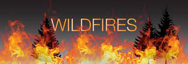
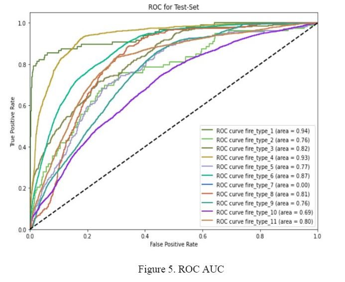

<!-- Add banner here -->

# Wildfire Analysis
<!-- Add buttons here -->

<!-- Describe your project in brief -->
In this research, we perfom analysis on wildfire dataset, and propose a model
to classify the wildfires based on environmental and geographical data.

**Full documentation is available inside "/docs" directory.**

# Table of contents
- [Abstract](#Abstract)
- [Dataset](#Dataset)
- [Results](#Results)
- [Conclusion](#Conclusion)

## Abstract
Environmental, social, and economic causatums from wildfires have been
continuously increasing around the world over the past decade. These fires not only
devastated forest and grassland but also detrimentally impacted wildfire habitat,
water quality & supply, tourism, and property values. In the past few years, a number
of research studies have been conducted to monitor, predict and prevent wildfires
using several Artificial Intelligence techniques such as Machine Learning, Deep
Learning, Big data, and Remote Sensing. In this paper, we proposed the wildfire
classification and prediction system to classify the wildfires into elven different types
based on the data on temperature anomalies from satellites and geographical data
using the CatBoost classifier. Quality metric - multi-class ROC-AUC has been
considered to evaluate the performance of the system. The proposed system achieved
high performance on the test set.

## Dataset
We collect the environmental data from `National Centers for Environmental Prediction (NCEP)` 

Source: 
[NCEP data](https://www.weather.gov/ncep/)

[Russian Cities data](https://github.com/pensnarik/russian-cities)

## Results

## Conclusion
In this project, we analysed the wildfire data and proposed a model to classify the wildfires
based on ensemble learning.